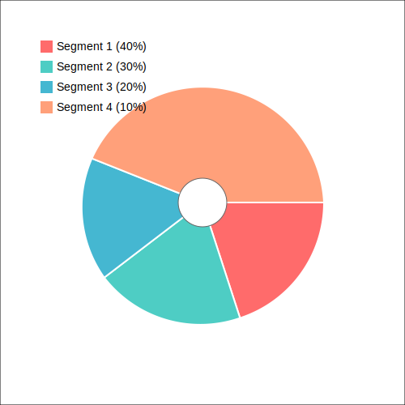

# Pie chart

I created the SVG file with the rectangle in VS Code and then asked co-pilot to: **"add a piechart to the svg file"**.
It created this example and gave me an explanation of it. There are also comments in the SVG file that help me navigate.

I coul dhave probably told co-pilot exactly the size of each part, which colors to use and what to write on the legend, but for now this looks ok.

I also noticed a small issue with the image. The text of the "legend" in the top left corner slightly overlaps with the pie-char itself.
I assume I could have asked co-pilot to move the legend a bit higher up or, if I understood the syntax of SVG I could edit the file myself to move the legend.

The biggest issue, however, is that this would assume that I already know all this information and I can manually type it in the prompt of co-pilot.
What if the percentages and the names of the parts are generated by some software? Then I'd probably want that software to generat the pie-chart itself.

So I asked co-pilot to **"Write a python function that will get the segments as parameters and will generate a similar SVG file"**.
It created a nice solution in Python though it did not use any 3rd party library.
It was a few hundred lines of code. Not something I'd like to keep maintaining.

So I asked **"is there a 3rd party library that could be used instead of implementing the creation of the chart?"**

It suggested [Pygal](https://www.pygal.org/en/stable/), [Matplotlib](https://matplotlib.org/), and [Plotly](https://plotly.com/python/).

I believe I could have further asked co-pilot to generate the pie-chart using one of the libraries, but I felt this was enough for the demonstration.



