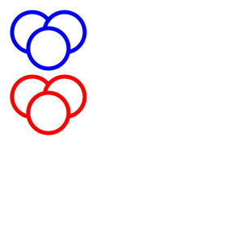

# g container element

* [Element g](https://developer.mozilla.org/en-US/docs/Web/SVG/Reference/Element/g) to group elements and to apply various attributes to all of them via inheritance.

In this example we see 2 sets of 3 circles. If you look at the definition of the circles you will see that both sets have the exact same parameters. So how come that the red set is lower?
Both sets are inside `g` elements. For the second set the `g` element has an attribute called `transform`  that has a value `translate(0, 80)`. Despite its name it moves all the elements
inside the `g`-tag horizontally and vertically. Specifically this moves the 3 red circles 80 pixels down.

You can also observe that in each set the circles overlap and one circle hides parts of the other two. They way SVG draws is from top to bottom in the file. Shapes that are later in the file
will be drawn on top of the shapes that came earlier in the file. On a later page we'll see how to make some of the shapes transparent, but for now the shapes are not and thus we cannot see
parts of the earlier shapes.



