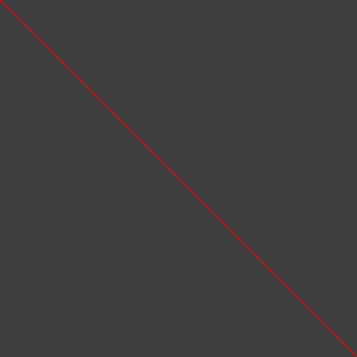

# Grid using Perl

With these 3 images we are trying to show how higher resolution makes the pixels "disappear".
In all 3 images we are drawing a diagonal line.

## The images

In the first image we have a resolution of 3x3 and thus the diagonal line consists of 3 pixels. It is very clear that these are pixels.


In the second image the resolution is 10x10. We can still clearly see the pixels, but we can also see that the line is a bit smoother.


In the third image the resolution is even better. It is 120x120 pixels. Due to the frequency of the grid lines the image is almost black, but those lines are only there so we can see the resolution.
The diagonal seems to be smooth. People with good eyes can still see that it is made out of individual pixels, but many people will already miss that.



If we increased the resolution even further, (eg. my external screen is 2560x1440 pixels and the built-in screen of my notebook is 3840x2400 pixels) the line would seem totally smooth.

## The code:

In this case it was written in Perl, but we have examples in other languages as well.



```
$ perl src/examples/perl/grid.pl 600 600 200 > src/examples/perl/grid-600-600-200.svg
$ perl src/examples/perl/grid.pl 600 600 60 > src/examples/perl/grid-600-600-60.svg
$ perl src/examples/perl/grid.pl 600 600 5 > src/examples/perl/grid-600-600-2.svg
```


